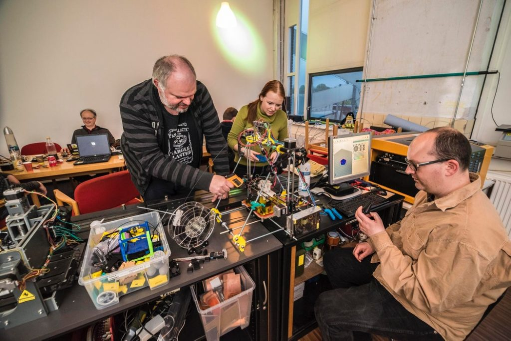
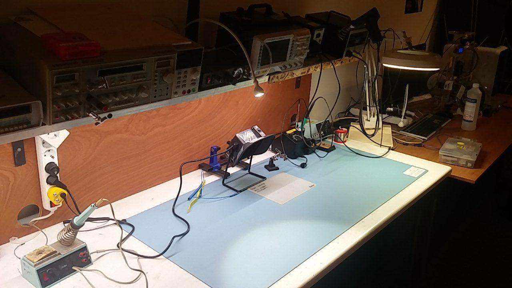
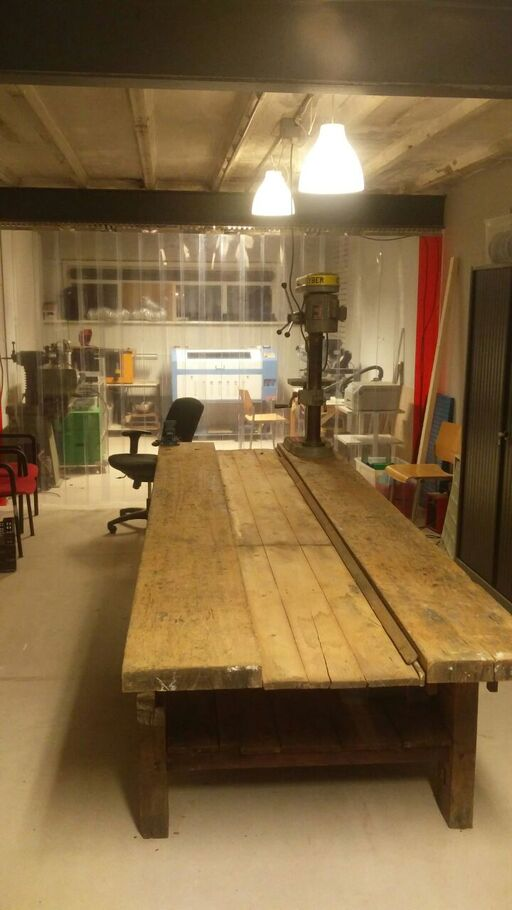
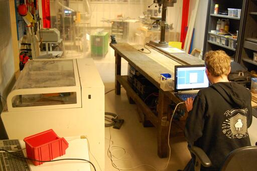

## De hackerspace (lounge)

Het TkkrLab is een hackerspace, een ruimte waar nerds bij elkaar komen en je gezellig kunt praten over de meest technische onderwerpen.
Alle spullen in de ruimte zijn bij elkaar verzameld door de deelnemers, het TkkrLab is echt 100% voor en door geeks: samen maken wij de ruimte.

Je vindt er alles wat je als hacker (geek / hobbyist / programmeur / elektrotechnieker of beunhaas, hoe je jezelf ook wilt noemen) ooit nodig zult hebben EN meer!

Er is een lange tafel in het midden waar je rustig aan kunt werken. Daarnaast is er zithoek voor als je uit je werk lekker onderuit wilt zakken onder het genot van een Club Mate uit de volgeladen koelkast.
Voor de iets meer technische dingen is er een grote werktafel waar alle voorzieningen te vinden zijn om ESD veilig met elektronica te werken. We hebben gereedschappen en componenten staan zodat je meteen kunt beginnen met prototypen.

Als je meer creatief bent aangelegd of gewoon een doosje wilt maken voor een projectje hebben we twee 3D printers staan waarmee je met PLA, PET of ABS kunt printen.
Gebruik van de machines is voor deelnemers gratis, je betaald alleen materiaalkosten (maar je kunt natuurlijk ook je eigen fillament meenemen). Het idee is dat je van andere deelnemers instructie krijgt over het gebruik van een machine,
waarna je zelf aan het experimenteren kunt. Uurtarieven en andere onzin zijn bij ons dus geen factoren waar je je druk om hoeft te maken.

Tot slot hebben we een arcade kast met RetroPi setup en hoop spelcomputers waar je op kunt gamen en heeft iedere deelnemer een eigen bak in de opslag, als veilige plek om je lopende projecten in op te bergen.

Heb je interesse? Je vindt de hackerspace in lokaal 2.08 van Spinnerij Oosterveld. Als we open zijn (zie rechts bovenin) is er iemand aanwezig en kan je dus langs komen.
Kom je na 7 uur 's avonds of in het weekend? Dan is de kans groot dat het hek van het terrein dicht zit. Bel ons dan even op 06-10745590, dan laten we je binnen.

Als je [deelnemer](/deelnemer-worden) wordt krijg je je eigen sleutel en kan je 24/7 gebruik maken van de ruimte. De enige dingen die wij niet toestaan zijn slapen in de space en het werken aan world domination plannen... Zie onze [huisregels](/wiki/Huisregels) voor meer details.

## De makerspace (werkplaats)

Naast de hackerspace, waar je rustig kunt komen werken, hebben we ook een ruimte waar je met zwaarder gereedschap aan de slag kunt.

Onze werkplaats is voorzien van een lasercutter, CNC frees, zaagtafel, twee kolomboren, een bandzaag, slijpmachines en meer. Ook is er een werkbank en bureau waaraan je kunt werken.

Als je deelnemer wordt krijg je natuurlijk ook 24/7 toegang tot de werkplaats, daarnaast geldt ook hier dat je alleen materiaalkosten betaald.
Tijd genoeg dus om rustig te leren hoe je de machines kunt gebruiken om je projecten uit te werken.

